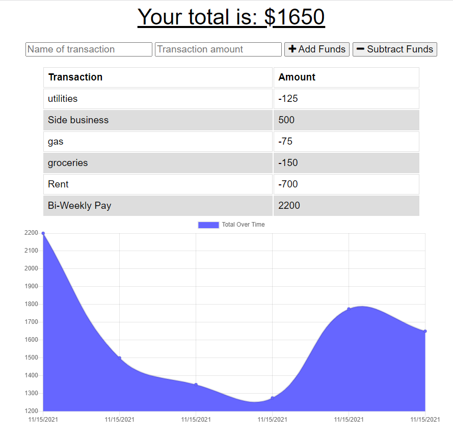

# Online/Offline_Budget_Tracker

## Description
An application that can be used to Track the user's funds and costs that can be updated while the application is offline.
This application is a progressive web application. Changes can be made and the database will update once the connection is established and the app is once again online.

## Table of Contents
* [Installation](#installation)
* [Usage](#usage)
* [License](#license)
* [Contributing](#contributing)
* [Tests](#tests)
* [Questions](#questions)

## Installation
To install necessary dependencies, run the following command:
        
        npm i

## Usage
The user is able to add funds and subtract costs by typing the name of the transaction and number amounts into the input field. 
The user can then choose to add this transaction as funds added or funds subtracted by selecting the corresponding button.

## License
This project is licensed under the MIT license.

## Links

## Questions
If you have any queations regarding the repo, open an issue or contact me directly at [jeffrey.beh@hotmail.com](mailto:jeffrey.beh@hotmail.com).
You can find more of my work at [jeffiftyone](https://github.com/jeffiftyone)
